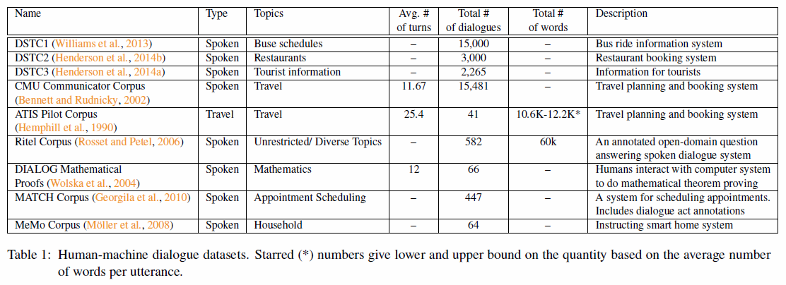
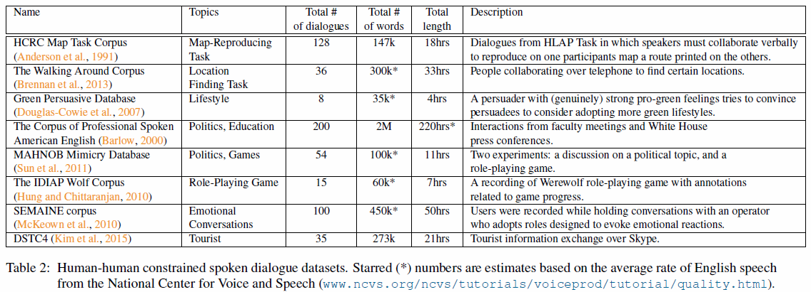

#A Survey of Available Corpora for Building Data-Driven Dialogue Systems
[1512.05742](https://arxiv.org/abs/1512.05742) 

Обзор доступных корпусов + обзор corpus-based подходов для построения  диалоговых систем.

Помимо corpus-based: обучение через взаимодействие с человеком, симуляторы пользователя, RL. Эти подходы в статье не описываются.

Диалоговые системы: goal / non-goal, генеративные / ранжирование (выбор лучшего ответа из заготовленных) / rule-based

Корпуса могут быть: 
- человек-человек / человек-машина
- письменная / устная речь (устная менее формальная, больше местоимений, сильнее зависит от контекста)
- естественные / неестественные: идеальный случай - участники диалога не знают, что их разговоры потом будут использованы, участники диалога - репрезентативная выборка из целевой аудитории диалоговой системы.
Если участники диалогов - нанимаемые люди, то может возникать проблема с тем, что их цели и мотивации могут отличаться от целей будущих пользователей диалоговой системы.
Подход получивший название *Wizard of Oz* (пользователь думает, что общается с агентом, но на самом деле ему отвечает другой человек) позволяет получить диалоги наиболее близкие к естественным.
- вымышленные диалоги (фильмы, литература)

##Сводные таблицы по доступным корпусам

Корпуса с диалогами могут быть использованы наряду с вопросно-ответными (QA) и рекомендательными датасетами, так можно выделить несколько задач, с которыми должны справляться диалоговые системы:
- ответы на вопросы пользователя (QA)
- рекомендации
- ответы на вопросы с рекомендациями
- поддержание беседы (casual conversation)
